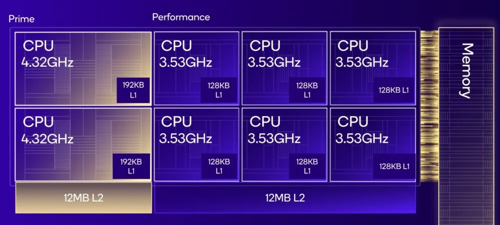

# Snapdragon X Series

## Examples

* Snapdragon X Elite X1E-84-100
* Snapdragon X Elite X1E-80-100
* Snapdragon X Elite X1E-78-100

## References

1.1. [Kryo: Qualcomm’s Last In-House Mobile Core](https://chipsandcheese.com/2023/07/12/kryo-qualcomms-last-in-house-mobile-core/) 
1.2. [Hot Chips 2024: Qualcomm’s Oryon Core](https://chipsandcheese.com/2024/08/26/hot-chips-2024-qualcomms-oryon-core/) 
1.3. [The Qualcomm Snapdragon X Architecture Deep Dive](https://web.archive.org/web/20240613141711/https://www.anandtech.com/show/21445/qualcomm-snapdragon-x-architecture-deep-dive) 

## Notes

* The Snapdragon X Elite will have 12 cores running up to 3.8 GHz, or up to 4.3 GHz using single- and dual-core boost. [1.3]

* Snapdragon Oryon v1 "Phoenix": [llm]
	- clock:         4.3 GHz
	- fp32 FLOPS/cy: 24  (3 × 128-bit FMA)
	- i32 ops/cy:    12  (3 x 128-bit INT SIMD pipes)
	- L1I:           192 KB
	- L1D:           128 KB
	- L1 latency:     3 cycles (load-to-use)
	- L1 bandwidth:  64 B/cy  (2 × 128-bit load ports + 2 × 128-bit store ports)
	- L2 latency:    9-10 cycles
	- L2 bandwidth:  64 B/cy  (256-bit internal path, dual-bank)
	- Vector / matrix formats: fp32, fp16, bf16, int8/16/32, dot-product,

* Snapdragon Oryon v1-LP: [llm]
	- clock:         3.5 GHz
	- fp32 FLOPS/cy: 16  (2 × 128-bit FMA pipes; lower area/power)
	- i32 OPS/cy:     8
	- L1I:           192 KB
	- L1D:           128 KB
	- L1 latency:     3 cycles
	- L1 bandwidth:  64 B/cy
	- L2 latency:    10-11 cycles
	- L2 bandwidth:  64 B/cy

# Snapdragon 8 Elite (Gen 4)

## Examples

## Notes

* 2x 4.3 GHz Oryon Gen 2 Prime *(similar to Cortex X4)*
* 6x 3.5 GHz Oryon Gen 2 Performance *(similar Cortex A720)*
* ARMv9.2

* Snapdragon Oryon v2 "Oryon Plus": [llm]
	- fp32 FLOPS/cy: 32  (2 × 256-bit FMA pipes)
	- i32 OPS/cy:    16
	- L1I:           192 KB
	- L1D:           96 KB
	- L1 latency:     3 cycles
	- L1 bandwidth:  128 B/cy  (2 × 256-bit loads + 2 × 256-bit stores)
	- L2 latency:    8-9 cycles
	- L2 bandwidth:  128 B/cy
	- Vector formats: fp32, fp16, bf16, fp8, int8/16/32/4, dot-product, SME2 tiles

* Instructions: rpres, afp, ecv, bti, rng, bf16, i8mm, frint, flagm2, dcpodp, pacg, paca, sb, ssbs, flagm, ilrcpc, uscat, dit, asimdfhm, sha512, asimddp, sm4, sm3, sha3, dcpop, lrcpc, fcma, jscvt, asimdrdm, cpuid, asimdhp, fphp, atomics, crc32, sha2, sha1, pmull, aes, evtstrm, asimd, fp

## References

# Snapdragon 8 Elite 2 (Gen 5)

## Examples

**Laptop**
* X2E (X2E-96-100)

**Mobile**
* Snapdragon 8 Elite gen 5
* Snapdragon 8 gen 5

## References

3.1. [Qualcomm’s Snapdragon X2 Elite](https://chipsandcheese.com/p/qualcomms-snapdragon-x2-elite) 

## Notes

* The L2 runs at the same clocks as the cores and supports over 220 in-flight transactions with each core supporting over 50 requests to the L2 at a time.
* There are over 400 Vector and Integer registers in their respective physical register files which is similar to the number of entries in Oryon Gen 1. Similarly, the Reorder Buffer is similarly 650+ entries for Oryon Gen 3.
* Oryon Gen 3 Prime core:
	* 6x 64bit integer pipes
	* SVE, SVE2
	* SVE instructions: sve, sveaes, svepmull, svesha3, svesm4, svei8mm, svebf16
	* 400 128b Vector registers
	* 4x 128b Vector ALUs
	* 4x 48-entry Reservation Stations for a total of 192 entries in the Vector scheduler.
	* L1I:
		- 192 KB
		- 6-way
		- 16x 4B instructions per cycle (64B/cy)
	* L1D:
		- 96 KB ?
		- 6 way
		- 64B line
		- read: 4x 32B/cy
		- write: 2x 32B/cy
	* L2:
		- X2: 16MB per cluster of 6x Prime cores
		- Gen5: 12MB per 2x Prime cores
		- 16-way
		- 64B/cy per core
		- 256B/cy per cluster
* SME
	* 8x8 or 4x8 grid
	* 128 FP32/INT32
	* 256 FP16/BF16/INT16
	* 512 INT8
	* instructions: sme, smei8i32, smef16f32, smeb16f32, smef32f32
* Oryon Gen 3 Performance core
	* 12 MB of shared L2 (per cluster of 6 cores)
	* targeted at a lower power point and has been optimized for operation below 2 watts
	* less wide (2x 128bit pipes?)
* NPU
	* 80 TOPS of INT8
	* FP8, BF16, INT2 support

* Other instructions: lrcpc3, rpres, afp, ecv, bti, rng, bf16, i8mm, frint, flagm2, dcpodp, pacg, paca, sb, ssbs, flagm, ilrcpc, uscat, dit, asimdfhm, sha512, asimddp, sm4, sm3, sha3, dcpop, lrcpc, fcma, jscvt, asimdrdm, cpuid, asimdhp, fphp, atomics, crc32, sha2, sha1, pmull, aes, evtstrm, asimd, fp

## Specs

* X2-90:
	- RAM: LPDDR5X-9523 128bit/192bit, 152-228 GB/s

* SoC X2E-96-100:
	- RAM: LPDDR5X-9523, 192bit, 228 GB/s, 48 - 128 GB
	- Prime core:
		* 12 cores (2 modules)
		* 4.45 GHz
		* 4.8 GHz 2-core turbo, 5 GHz 1-core turbo
		* L1: 288 KB per core
		* L2: 16 MB per module, 32 MB total
	- Performance core:
		* 6 cores
		* 3.6 GHz
		* L1: 288 KB per core
		* L2: 12 MB shared
	- L2: 44 MB total
	- L3: 9 MB
	- NPU: 80 TOPS (i8)
	- TDP: 82W

* SoC X2E-80-100:
	- RAM: LPDDR5X-9523 128bit, 152 GB/s
	- Prime core:
		* 6 cores (1 module)
		* 4 GHz
		* 4.4 GHz 2-core turbo, 4.7 GHz 1-core turbo
		* L1: 288 KB per core
		* L2: 16 MB per module
	- Performance core:
		* 6 cores
		* 3.4 GHz
		* L1: 288 KB per core
		* L2: 12 MB shared
	- L2: 28 MB total
	- L3: 9 MB
	- NPU: 80 TOPS (i8)
	- TDP: 55W

* SoC Elite 8 Gen 5
	- RAM: LPDDR5X, 64-bit, 5300 MHz, 84.8 GB/s
	- Prime core:
		* 2 cores
		* 4.6 GHz
		* L1: 192 KB per core
		* L2: 12 MB per cluster
	- Performance core:
		* 6 cores
		* 3.6 GHz
		* L1: 128 KB per core
		* L2: 12 MB per cluster
	- L2: 24 MB total
	- system-level cache: 8 - 16 MB
	- TDP: 12W (up to 22W from tests)
