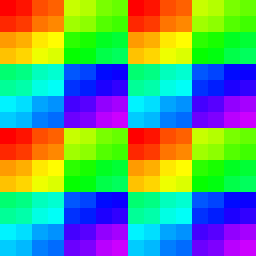
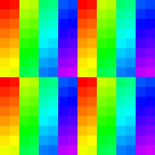

4th generation Graphics Core Next architecture, code name: Polaris. 
8 generation of AMD GFX IP.

## Examples

* Radeon RX 460, 470, 480M, 560
* Radeon RX 540, 550, 550X, 560, 560 XT, 570, 580, 590
* Radeon RX 630, 640

## References

1. [Dissecting the Polaris Architecture](https://www.amd.com/system/files/documents/polaris-whitepaper.pdf), [[backup](../pdf/polaris-whitepaper.pdf)]

## Specs

### Subgroup threads order

Result of `Rainbow( gl_SubgroupInvocationID / gl_SubgroupSize )` in fragment shader, gl_SubgroupSize = 64.

Result of `Rainbow( gl_SubgroupInvocationID / gl_SubgroupSize )` in compute shader, gl_SubgroupSize = 64, workgroup size: 8x8.

