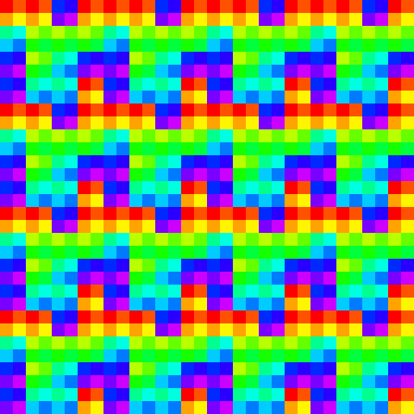
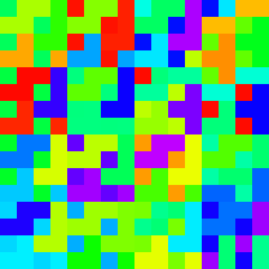

Valhall is a 4th generation of Mali GPU architecture.

Content:
* [Gen1](#Valhall-Gen1)
* [Gen2](#Valhall-Gen2)
* [Gen3](#Valhall-Gen3)
* [Gen4](#Valhall-Gen4)
* [All gens](#Valhall-(all-gens))

# Valhall Gen1

## Examples

* Mali-G57
* Mali-G77

## References

1.1. [Arm's New Mali-G77 & Valhall GPU Architecture](https://www.anandtech.com/show/14385/arm-announces-malig77-gpu) 
1.2. [Arm Mali-G77 Performance Counters Reference Guide](https://developer.arm.com/documentation/102730/latest/), [[backup](../pdf/arm_mali-g77_performance_counters_reference_guide_102730_0106_en.pdf)] 

## Notes

* Static branching or early termination is not supported. [[az](https://github.com/azhirnov)]
* 2 work queues: non-fragment, fragment. [1.2]

# Valhall Gen2

## Examples

* Mali-G68
* Mali-G78

## References

2.1. [Arm Announces The Mali-G78 GPU](https://www.anandtech.com/show/15816/arm-announces-the-malig78-evolution-to-24-cores) 
2.2. [Mali-G78 Performance Counters Reference Guide](https://developer.arm.com/documentation/102626/0100), [[backup](../pdf/arm_mali-g78_performance_counters_reference_guide_102626_0106_en.pdf)] 

# Valhall Gen3

## Examples

* Mali-G310
* Mali-G510
* Mali-G610
* Mali-G710

## References

3.1. [Arm Mali-G610 Performance Counters Reference Guide](https://developer.arm.com/documentation/102812/0108/), [[backup](../pdf/arm_mali-g610_performance_counters_reference_guide_102812_0107_en.pdf)] 
3.2. [Arm Announces New Mali-G710, G610, G510 & G310 Mobile GPU Families](https://www.anandtech.com/show/16694/arm-announces-new-malig710-g610-g510-g310-mobile-gpu-families) 
3.3. [Mali-G510](https://developer.arm.com/Processors/Mali-G510) 

## Notes

* G610, G710 L2 cache: Configurable 512KB – 2MB, 2 or 4 slices of 256K or 512K
* Scalability: 7 to 16 cores

* 3 hardware work queues: compute, vertex, fragment.
* Arm Fixed Rate Compression (AFRC), 4x4 block lossy compression for textures and framebuffer. [3.3]

# Valhall Gen4

## Examples

* Mali-G615
* Mali-G715
* Immortalis-G715

## References

4.1. [Arm Mali-G615 Performance Counters Reference Guide](https://developer.arm.com/documentation/107775/0106), [[backup](../pdf/arm_mali-g615_performance_counters_reference_guide_107775_0105_en.pdf)] 
4.2. [The Valhall Shader Core](https://developer.arm.com/documentation/102203/0100/Fourth-generation-Mali-GPU-architecture), [[backup](../pdf/the_valhall_gen4_shader_core_guide_102203_0100_03_en.pdf)] 

## Notes

* The FMA and SVT pipelines are 16-wide, the SFU pipeline is 4-wide and runs at one quarter of the throughput of the other two. [4.2]
* Valhall maintains native support for int8, int16, and fp16 data types. These data types can be packed using SIMD instructions to fill each 32-bit data processing lane. This arrangement maintains the power efficiency and performance that is provided by the types that are narrower than 32-bits. [4.2]
* A single 16-wide warp maths unit can therefore perform 32x fp16/int16 operations per clock cycle, or 64x int8 operations per clock cycle. [4.2]

* LSU: [4.2]
	- 64-byte cache line.
	- 16KB L1 data cache per core
	- Warp unit accesses are optimized to reduce unique cache access requests. Data can be returned in a single cycle if all threads access data inside the same cache line.
* varying unit can interpolate 32 bits for every thread in a warp. [4.2]
* Variable rate shading (VRS).

# Valhall (all gens)

## References

1. [Instruction Set Architecture](https://rosenzweig.io/Valhall-Documentation.pdf), [[backup](../pdf/Valhall-Documentation.pdf)]
2. [Mesa driver details](https://docs.mesa3d.org/drivers/panfrost.html)

## Notes

* scalar
* 16 threads per warp. [1.2, 4.2]
* Fragment Task with 32x32 pixels region. [1.2]
* AFBC (v1.3) with 4x4 block.
* MSAA: 4x, 8x, 16x
* Transaction Elimination with 16x16 pixel block size.

* All Valhall GPU cores implement a 4 texel-per-clock and 2 pixel-per-clock shader core.
* Mali Valhall GPU shader cores allow variable numbers of threads to be created, depending on the number of work registers that are used by the in-flight shader programs.
	- 0-32 registers - Maximum thread capacity
	- 33-64 registers - Half thread capacity
* A Valhall core can perform 32 FP32 FMAs, read 4 bilinear filtered texture samples, blend 2 fragments, and write 2 pixels per clock. [4.2]

* Each Processing Engine (PE) executes the programmable shader instructions. [4.2]
* Each PE includes 3 arithmetic processing pipelines: [4.2]
	- FMA pipeline with is used for complex maths operations
	- CVT pipeline which is used for simple maths operations
	- SFU pipeline which is used for special functions

### Subgroup threads order

Result of `Rainbow( gl_SubgroupInvocationID / gl_SubgroupSize )` in fragment shader, gl_SubgroupSize: 16, tile size: 32x32.

Unique subgroups, image size: 32x32, gl_SubgroupSize: 16. Each subgroup in tile scheduled by quads (2x2 pixels), each quad may have any position inside 32x32 pixel tile, but often they are placed inside 8x8 region. 

Result of `Rainbow( gl_SubgroupInvocationID / gl_SubgroupSize )` in compute shader, gl_SubgroupSize: 16, workgroup size: 8x8.

