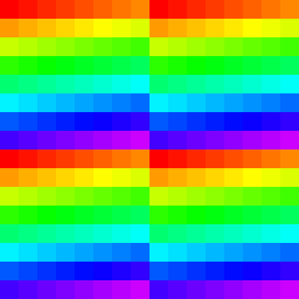

## Examples

* 640, 660

## References

1. [Mesa driver details](https://docs.mesa3d.org/drivers/freedreno.html)
2. [Qualcomm Details The Snapdragon 888](https://www.anandtech.com/show/16271/qualcomm-snapdragon-888-deep-dive)
3. [Inside the Snapdragon 855’s iGPU](https://chipsandcheese.com/2024/05/01/inside-the-snapdragon-855s-igpu/)
4. [Correction on Qualcomm iGPUs](https://chipsandcheese.com/2024/05/06/correction-on-qualcomm-igpus/)

## Notes

* Has low resolution Z pass:
 "During the binning pass, a low resolution Z-buffer is constructed, and can reject LRZ-tile wide contributions to boost binning performance. This LRZ is then used during the rendering pass to reject pixels efficiently before testing against the full resolution Z-buffer."
* Has forward pass for fullscreen quad/triangle.

### Subgroup threads order

Result of `Rainbow( gl_SubgroupInvocationID / gl_SubgroupSize )` in fragment shader, gl_SubgroupSize = 64.

Result of `Rainbow( gl_SubgroupInvocationID / gl_SubgroupSize )` in compute shader, gl_SubgroupSize = 64, workgroup size: 8x8.

