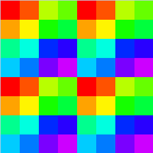
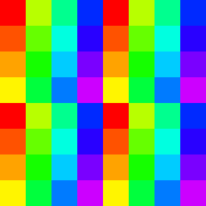

code names: Skylake, Apollo Lake, Kaby Lake, Kaby Lake Refresh, Amber Lake, Coffee Lake, Coffee Lake Refresh, Whiskey Lake, Comet Lake, Gemini Lake, Gemini Lake Refresh.

## Examples

### Skylake
* HD Graphics 530
* Iris Graphics 550

### Apollo Lake
* HD Graphics 500

### Kaby Lake (gen 9.5)
* HD Graphics 620
* Iris Plus Graphics 640

### Kaby Lake Refresh / Amber Lake / Coffee Lake / Coffee Lake Refresh / Whiskey Lake / Comet Lake
* UHD Graphics 630
* Iris Plus Graphics 655

### Gemini Lake/Gemini Lake Refresh
* UHD Graphics 600

## References

1. [Instruction Set Architecture](https://software.intel.com/sites/default/files/managed/89/92/Intel-Graphics-Architecture-ISA-and-microarchitecture.pdf), [[webarchive](https://web.archive.org/web/20201108102656/https://software.intel.com/sites/default/files/managed/89/92/Intel-Graphics-Architecture-ISA-and-microarchitecture.pdf)], [[backup](../pdf/Intel-Graphics-gen9-Architecture-ISA-and-microarchitecture.pdf)]
2. [Compute Architecture of Intel Processor Graphics Gen9](https://cdrdv2-public.intel.com/774710/the-compute-architecture-of-intel-processor-graphics-gen9-v1d0-166010.pdf), [[backup](../pdf/the-compute-architecture-of-intel-processor-graphics-gen9-v1d0-166010.pdf)]
3. [Graphics API Performance Guide for Intel Processor Graphics Gen9]https://cdrdv2-public.intel.com/671201/graphics-api-performance-guide-2-5.pdf), [[backup](../pdf/graphics-api-performance-guide-2-5.pdf)]

## Notes

* Branches: 
On hardware with structured control flow instructions such as Intel, the loop break instruction does not always jump to the end of the loop. Instead, it removes the active invocations from some sort of internal execution mask to ensure that they get disabled on the next iteration of the loop. Once the final invocation is disabled (the execution mask goes to zero), the hardware jumps to the end of the loop. [ref](https://www.collabora.com/news-and-blog/blog/2024/04/25/re-converging-control-flow-on-nvidia-gpus/)

## Specs

* Each EU contains 2 x 128-bit FPUs.
* One FPU supports 32-bit and 64-bit integer, FP16, FP32, FP64, and transcendental math functions.
* Other FPU supports only 32-bit and 64-bit integer, FP16 and FP32.
* Each Subslice contains 8 EUs (two of which are disabled in GT1) and a sampler (4 tex/clk), and has 64 KB shared memory.

### Subgroup threads order for Gen9.5

Result of `Rainbow( gl_SubgroupInvocationID / gl_SubgroupSize )` in fragment shader, gl_SubgroupSize = 16.

Result of `Rainbow( gl_SubgroupInvocationID / gl_SubgroupSize )` in compute shader, gl_SubgroupSize = 16, workgroup size: 8x8.

