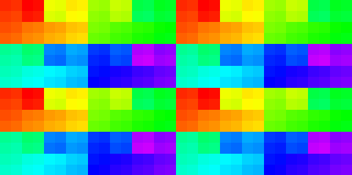
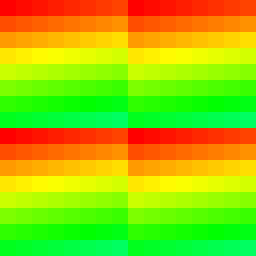
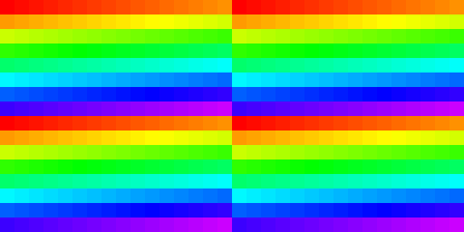

## Examples

* BXM-4-64
* BXM-8-256
* BXT-32-1024 MC1
* BXS
* BXE

## References

1. [Imagination Announces B-Series GPU IP](https://www.anandtech.com/show/16155/imagination-announces-bseries-gpu-ip-scaling-up-with-multigpu)
2. [Imagination Launches IMG B-Series](https://www.techpowerup.com/273334/imagination-launches-img-b-series-doing-more-with-multi-core-up-to-6-teraflops-of-compute)

## Notes

* B-Series now offers a 35% reduction in bandwidth compared to the A-Series and previous generation Imagination GPU architectures. [1]
* IMG B-Series also includes IMGIC, the most advanced image compression technology in the market to provide new bandwidth saving options for our customers. It offers up to four levels of compression, from pixel-perfect lossless modes to an extreme bandwidth-saving mode, which offers a guaranteed 4:1 or better compression rate. [2]
* Variants: [2]
	- IMG BXE: It can drive 1-16 pixels per clock (PPC) and scales from 720p resolution to 8K with a range of GPUs specifically designed for user-interface rendering and entry-level gaming. BXE offers up to 25% area saving compared to previous generation cores and up to 2.5 times the fill rate density compared to the competition.
	- IMG BXM: This includes high-efficiency performance cores balancing fill rate and compute in a compact silicon area for mid-range mobile gaming and complex UI solutions for DTV and other markets.
	- IMG BXT: This is focused on high performance for real-world applications, scaling from the device in your hand to the datacenter. The flagship B-Series GPU is a four-core part generating 6.0 teraflops of performance, 192 gigapixels per second, and 24 trillion operations per second (TOPS) for AI.
	- IMG BXS: These automotive GPUs are ISO 26262-capable. They range from entry to premium, delivering solutions for next-generation HMI, UI display, infotainment, digital cockpit, and surround view to multi-teraflop compute-focused configurations for autonomy and advanced driver assistance systems (ADAS).

## Specs

* BXM-8-256 Performance:
	- F16 GFlops: 460  | 512 FP16 FLOPs/Clock
	- F32 GFlops: 230  | 256 FP32 FLOPs/Clock
	- 8 texels / clock

* MADD = 2 FLOPs, MUL = 1 FLOP [1]

### Subgroup threads order

Result of `Rainbow( gl_SubgroupInvocationID / gl_SubgroupSize )` in fragment shader, gl_SubgroupSize: 128, tile size: 32x32.

Result of `Rainbow( gl_SubgroupInvocationID / gl_SubgroupSize )` in compute shader, gl_SubgroupSize: 128, workgroup size: 8x8.

Result of `Rainbow( gl_SubgroupInvocationID / gl_SubgroupSize )` in compute shader, gl_SubgroupSize: 128, workgroup size: 16x16.

